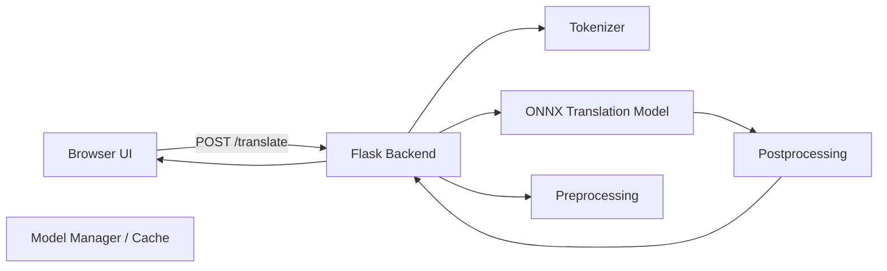

# **architecture.md**

> **DweepLingo — AI Core & System Architecture**
> *Offline English ↔ Hindi Translation MVP*

This document defines the architecture, component responsibilities, data flow, model pipeline, offline guarantees, and packaging strategy for the DweepLingo MVP.

---

# **1. Overview**

**DweepLingo** is a fully offline English ↔ Hindi translation system designed to run on any standard PC with:

* No internet
* No installation
* No cloud dependencies
* Low CPU and RAM usage

The goal is to provide a secure, fast, government-ready translation system packaged as a single ZIP with a one-click launcher (`run.bat` / `run.sh`).

---

# **2. High-Level Architecture**

```
[Browser UI]  <--HTTP-->  [Local Backend (Flask)]
                                     |
                                     +--> [Tokenizer]
                                     +--> [Preprocessing / Postprocessing]
                                     +--> [ONNX Runtime Model]
                                     +--> [Model Manager & Cache]
```

### **Mermaid Diagram**



---

# **3. Components & Responsibilities**

## **3.1 Frontend (Browser UI)**

* Pure **HTML/CSS/JS**
* Contains:

  * Input text area
  * Output text area
  * Language selector
  * Translate button
  * Offline status indicator
* Served locally by Flask
* No external CDN or assets

---

## **3.2 Local Backend (Flask Server)**

* Python + Flask
* Routes:

  * `POST /translate`
  * `GET /health`
* Loads ONNX model + tokenizer on startup
* Orchestrates:

  * Preprocessing
  * Tokenization
  * ONNX inference
  * Decoding
  * Postprocessing
* Returns JSON responses

---

## **3.3 AI Core (Model + Tokenizer)**

### **Tokenizer**

* Loaded fully from local folder:
  `models/en-hi/`
* Files:

  * `tokenizer.json`
  * `tokenizer_config.json`
  * `special_tokens_map.json`
  * `sentencepiece.model` (if applicable)

### **Model**

* Base model: **IndicTrans2 Distilled 200M**
* Converted to **ONNX/ORT**
* Quantized to **INT8**

Inference:

* ONNX Runtime
* CPUExecutionProvider
* Suitable for offline CPUs

---

## **3.4 Model Manager & Cache**

Responsibilities:

* Load models and tokenizers
* Maintain in-memory instances
* Provide `get_model(direction)`
* Track:

  * load time
  * latency
  * cache hit/miss

---

# **4. Detailed Request Flow**

### **1) User Input**

User enters text and selects direction: EN→HI or HI→EN.

### **2) Frontend Request**

Sends:

```json
POST /translate
{
  "direction": "en-hi",
  "text": "Hello, how are you?",
  "max_length": 256
}
```

### **3) Backend Workflow**

1. Validate request
2. Preprocess text
3. Tokenize
4. Run ONNX model
5. Decode output tokens
6. Postprocess
7. Return JSON

### **4) Response**

```json
{
  "ok": true,
  "translation": "नमस्ते, आप कैसे हैं?",
  "model": "indictrans2.quant.v1",
  "latency_ms": 220
}
```

---

# **5. Model Pipeline (Build-Time)**

## **5.1 Step 1 — Select Model**

`ai4bharat/indic-trans2-distilled-200m`

## **5.2 Step 2 — Export to ONNX**

Using `optimum.onnxruntime`:

* `ORTModelForSeq2SeqLM`
* Saves ONNX + model config

## **5.3 Step 3 — Quantization**

Dynamic INT8:

* Reduces size 40–60%
* Speeds inference
* Keeps accuracy stable

Produces:

```
model.quant.onnx
```

## **5.4 Step 4 — Validation**

Run:

* Sanity translations
* BLEU evaluation
* Latency benchmarking
* Memory usage checks

Save results in:
`verification_report.pdf`

---

# **6. Offline-Only Design Guarantees**

### **6.1 Strict Local Loading**

Every model load uses:

```python
AutoTokenizer.from_pretrained("models/en-hi", local_files_only=True)
ORTModelForSeq2SeqLM.from_pretrained("models/en-hi", local_files_only=True)
```

### **6.2 Disable all HuggingFace Downloads**

Use environment variables:

```python
os.environ['TRANSFORMERS_OFFLINE'] = '1'
os.environ['HUGGINGFACE_HUB_OFFLINE'] = '1'
os.environ['HF_DATASETS_OFFLINE'] = '1'
```

### **6.3 No Online Dependencies**

* No CDNs
* No remote fonts
* No external JS frameworks

---

# **7. Performance Guidelines**

### **Target Performance (mid-spec CPU)**

* **Cold load time:** 20–60s
* **Warm inference:** 200–800ms
* **Memory usage:** ~0.5–2GB
* **Model size (quantized):** 150–300MB per direction

### **Scalability**

* Load 2 models simultaneously (EN→HI, HI→EN)
* Optional HQ FP32 fallback for high-end hardware

---

# **8. API Contract**

### **POST /translate**

**Request body:**

```json
{
  "direction": "hi-en",
  "text": "आप कैसे हैं?"
}
```

**Response:**

```json
{
  "ok": true,
  "translation": "How are you?",
  "latency_ms": 310
}
```

### **GET /health**

```
{
  "ok": true,
  "models": {
    "en-hi": true,
    "hi-en": true
  }
}
```

---

# **9. Packaging & Final ZIP Structure**

```
dweep-lingo/
├── models/
│   ├── en-hi/
│   │   ├── model.quant.onnx
│   │   ├── tokenizer.json
│   │   ├── tokenizer_config.json
│   │   └── metadata.json
│   └── hi-en/
├── server/
│   ├── app.py
│   ├── inference.py
│   └── utils.py
├── frontend/
│   ├── index.html
│   ├── script.js
│   └── style.css
├── run.bat
├── run.sh
└── README.txt
```

### **Packaging Method**

* Prefer PyInstaller `--onedir`
* Keep ONNX models outside the `.exe`
* Bundle entire project into one ZIP

---

# **10. Logging, Testing, Monitoring**

### **Logging**

* Time per translation
* Request count
* Errors
* Model load time
* No raw text logs (privacy)

### **Testing**

* Unit tests: tokenizer, pre/post-processing
* Integration tests: 100–200 sentences
* API tests: `/translate`, `/health`

### **Monitoring (optional)**

Expose `/metrics`:

* Latency P50/P95
* Cache stats
* Translation count

---

# **11. Acceptance Criteria**

The system is considered **production-ready** when:

* Runs 100% offline
* Both directions translate correctly
* Cold + warm latency within expected range
* ZIP size ≤ 600MB
* No HF-network calls
* Model files load without retries
* Verification report completed

---

# **12. Known Limitations**

* Slight BLEU drop due to quantization
* Heavy sentences on low-end CPUs = slower inference
* Antivirus may flag PyInstaller bundles
* ONNX Runtime size increases ZIP size

---

# **13. Quick Code Snippets**

### **Load ORT model**

```python
from optimum.onnxruntime import ORTModelForSeq2SeqLM
model = ORTModelForSeq2SeqLM.from_pretrained("models/en-hi", local_files_only=True)
```

### **Set offline mode**

```python
import os
os.environ["TRANSFORMERS_OFFLINE"] = "1"
os.environ["HUGGINGFACE_HUB_OFFLINE"] = "1"
```

### **Quantize model**

```python
from onnxruntime.quantization import quantize_dynamic, QuantType
quantize_dynamic("model.onnx", "model.quant.onnx", weight_type=QuantType.QInt8)
```

---

# **14. References**

* IndicTrans2 Paper & Repo
* ONNX Runtime Documentation
* HuggingFace Optimum
* Seq2Seq Inference Best Practices
* AI4Bharat Indic NLP Resources

---
